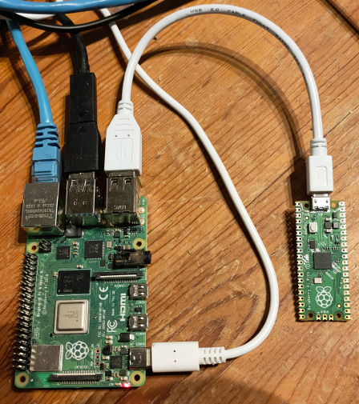

# Talker

## Send commands to the Pico and read their results.

This project was first covered [here](https://blog.rareschool.com/2021/01/controlling-raspberry-pi-pico-using.html).

### Connect the host and the Pico

Connect the host to the Pico using a USB *data* lead. Some USB leads only supply power. *They will not work*.

### Install software on the Pico

The `blinker.py` script runs on the Pico, but you should rename it to main.py.

Install it on the Pico using the Thonny editor.

1. Open the gist on GitHub.
1. Copy the code to your clipboard.
1. Open Thonny and make sure it has connected to the Pico.
1. Paste the code into the Thonny editor window.
1. Save it on the Pico **as main.py**.
1. Close the Thonny editor!

If you leave the Thonny editor open it will keep the serial port open on the host, and the serial program below 
*will not work*!

Since you saved the program as main.py it will run on the Pico automatically.

## On the Pi

The `talker.py` script runs on the Raspberry Pi. It uses PySerial to send commands from the host to the 
Pico and read the result.

To use it

1. Run pip3 install pyserial.
1. Copy talker.py into a directory of your choice.
1. In that directory, run python3 to start an interactive session.
1. Type `from talker import Talker`
1. Type t = Talker(). *If you are running on Windows, you will need to type* `t = Talker('COM6')` *replacing COM6 by 
   whatever port the Pico is connected to*.
1. Type `t.send('2 + 2')`
1. Type `t.receive()` - if all is well, this will print the result 4.
1. Type `t.send('on()'` - the on-board LED on the Pico should turn on.
1. Type `t.send('off()'` - the on-board LED on the Pico should turn off.
1. When you have finished, `type t.close()`.